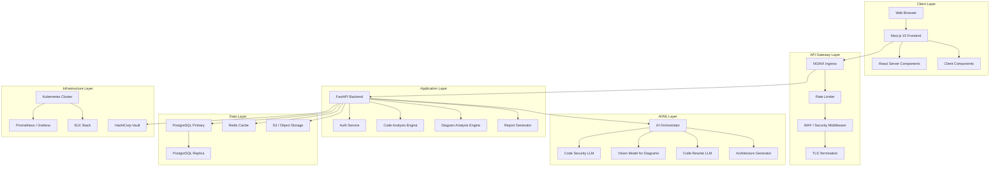
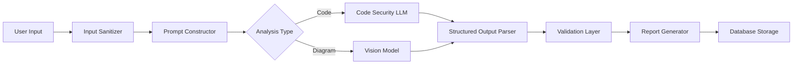

# ShadowScan Platform - System Architecture

## Executive Summary

ShadowScan is a production-grade security analysis platform that provides automated code security analysis and architecture diagram assessment using AI-powered analysis engines. Built on Zero Trust principles and following security-by-design methodology.

## Architecture Overview



## Component Architecture

### 1. Frontend Layer (Next.js 15)

**Technology Stack:**
- Next.js 15.0+ with App Router
- React 18+ Server Components
- TypeScript 5.3+
- Tailwind CSS 4.0
- Shadcn/ui components
- Monaco Editor for code input
- React-Dropzone for file uploads

**Security Controls:**
- Content Security Policy (CSP) headers
- Subresource Integrity (SRI)
- CSRF protection
- XSS prevention via React sanitization
- Secure cookie handling (httpOnly, secure, sameSite)
- Rate limiting on client actions

**Key Features:**
- Server-side rendering for initial load
- Client-side hydration for interactivity
- Code syntax highlighting with language detection
- Drag-and-drop file upload
- Real-time analysis progress tracking
- Dark mode (default) with system preference detection

### 2. Backend Layer (FastAPI)

**Technology Stack:**
- Python 3.12+
- FastAPI 0.110+
- Pydantic v2 for validation
- SQLAlchemy 2.0 for ORM
- Alembic for migrations
- Celery for async task processing
- Redis for caching and task queue

**Security Middleware Stack:**
```
Request → Rate Limiter → CORS → Auth → Input Validation → Anti-SSRF → File Sanitizer → Handler
```

**API Endpoints:**

```
POST   /api/v1/auth/register
POST   /api/v1/auth/login
POST   /api/v1/auth/refresh
POST   /api/v1/auth/logout

POST   /api/v1/analyze/code
GET    /api/v1/analyze/code/{id}
POST   /api/v1/analyze/diagram
GET    /api/v1/analyze/diagram/{id}

GET    /api/v1/reports/{id}
GET    /api/v1/reports
DELETE /api/v1/reports/{id}

GET    /api/v1/users/me
PATCH  /api/v1/users/me
GET    /api/v1/users/history
```

**Security Controls:**
- JWT authentication with short-lived tokens (15min access, 7d refresh)
- Argon2id password hashing
- Rate limiting: 100 req/min per IP, 1000 req/hour per user
- Input validation with Pydantic
- SQL injection prevention via ORM
- Path traversal prevention
- File type validation (whitelist only)
- File size limits (50MB max)
- Anti-SSRF protection
- Audit logging of all security-relevant events

### 3. AI Orchestration Pipeline

**Architecture:**


**LLM Integration:**
- Primary: Claude 3.5 Sonnet / GPT-4 Turbo for code analysis
- Vision: Claude 3.5 Sonnet / GPT-4 Vision for diagram analysis
- Fallback: Open-source models (CodeLlama, Llama 3.1) for cost optimization

**Prompt Engineering Strategy:**
1. **System Prompt**: Defines role, constraints, output format
2. **Context Injection**: Adds security frameworks (OWASP, CWE, CERT)
3. **User Input**: Sanitized code or diagram
4. **Structured Output**: JSON schema enforcement
5. **Validation**: Pydantic models validate LLM output

**Prompt Injection Prevention:**
- Input sanitization with allowlist filtering
- Prompt templating with variable escaping
- Output validation against expected schema
- Sandboxed execution environment
- Rate limiting on AI API calls
- Cost monitoring and budget caps

**Structured Output Format:**
```json
{
  "analysis_id": "uuid",
  "timestamp": "ISO8601",
  "language": "string",
  "vulnerabilities": [
    {
      "id": "CWE-89",
      "title": "SQL Injection",
      "severity": "CRITICAL",
      "confidence": 0.95,
      "location": {
        "file": "app.py",
        "line": 42,
        "snippet": "..."
      },
      "description": "...",
      "impact": "...",
      "exploitability": "HIGH",
      "remediation": "...",
      "references": ["OWASP-A03:2021", "CWE-89"],
      "secure_code": "..."
    }
  ],
  "summary": {
    "total_issues": 5,
    "critical": 1,
    "high": 2,
    "medium": 2,
    "low": 0
  },
  "dependencies": [...],
  "secrets": [...],
  "compliance": {...}
}
```

### 4. Database Architecture

**Schema Design:**

```sql
-- Users table with security controls
CREATE TABLE users (
    id UUID PRIMARY KEY DEFAULT gen_random_uuid(),
    email VARCHAR(255) UNIQUE NOT NULL,
    password_hash VARCHAR(255) NOT NULL,
    full_name VARCHAR(255),
    is_active BOOLEAN DEFAULT true,
    is_verified BOOLEAN DEFAULT false,
    created_at TIMESTAMP DEFAULT NOW(),
    updated_at TIMESTAMP DEFAULT NOW(),
    last_login TIMESTAMP,
    failed_login_attempts INT DEFAULT 0,
    locked_until TIMESTAMP
);

-- Analysis jobs table
CREATE TABLE analysis_jobs (
    id UUID PRIMARY KEY DEFAULT gen_random_uuid(),
    user_id UUID REFERENCES users(id) ON DELETE CASCADE,
    type VARCHAR(50) NOT NULL, -- 'code' or 'diagram'
    status VARCHAR(50) NOT NULL, -- 'pending', 'processing', 'completed', 'failed'
    input_hash VARCHAR(64) NOT NULL,
    language VARCHAR(50),
    file_path VARCHAR(500),
    created_at TIMESTAMP DEFAULT NOW(),
    completed_at TIMESTAMP,
    error_message TEXT
);

-- Analysis results table
CREATE TABLE analysis_results (
    id UUID PRIMARY KEY DEFAULT gen_random_uuid(),
    job_id UUID REFERENCES analysis_jobs(id) ON DELETE CASCADE,
    result_data JSONB NOT NULL,
    severity_summary JSONB,
    created_at TIMESTAMP DEFAULT NOW()
);

-- Audit log
CREATE TABLE audit_log (
    id UUID PRIMARY KEY DEFAULT gen_random_uuid(),
    user_id UUID REFERENCES users(id),
    action VARCHAR(100) NOT NULL,
    resource_type VARCHAR(50),
    resource_id UUID,
    ip_address INET,
    user_agent TEXT,
    details JSONB,
    created_at TIMESTAMP DEFAULT NOW()
);

-- Indexes for performance
CREATE INDEX idx_analysis_jobs_user_id ON analysis_jobs(user_id);
CREATE INDEX idx_analysis_jobs_status ON analysis_jobs(status);
CREATE INDEX idx_analysis_results_job_id ON analysis_results(job_id);
CREATE INDEX idx_audit_log_user_id ON audit_log(user_id);
CREATE INDEX idx_audit_log_created_at ON audit_log(created_at);
```

**Security Controls:**
- Encryption at rest (PostgreSQL TDE)
- Encryption in transit (TLS 1.3)
- Row-level security (RLS) policies
- Database user with minimal privileges
- Automated backups (hourly incremental, daily full)
- Point-in-time recovery enabled
- Secrets stored in HashiCorp Vault
- Connection pooling with PgBouncer

### 5. Infrastructure & Deployment

**Kubernetes Architecture:**
```
├── Namespace: shadowscan-prod
│   ├── Deployment: frontend (3 replicas)
│   ├── Deployment: backend (5 replicas)
│   ├── Deployment: celery-worker (10 replicas)
│   ├── StatefulSet: postgresql (3 replicas)
│   ├── Deployment: redis (3 replicas)
│   ├── Service: LoadBalancer
│   ├── Ingress: NGINX with TLS
│   ├── ConfigMap: app-config
│   ├── Secret: app-secrets (sealed)
│   ├── HPA: Horizontal Pod Autoscaler
│   └── NetworkPolicy: Zero Trust segmentation
```

**Zero Trust Implementation:**

1. **Network Segmentation:**
   - Frontend pods: Can only communicate with backend
   - Backend pods: Can communicate with DB, Redis, AI services
   - Database pods: Accept connections only from backend
   - Deny all by default, allow by exception

2. **Identity & Access:**
   - Service mesh (Istio) for mTLS between services
   - Pod identity via Workload Identity
   - Secrets management via External Secrets Operator + Vault
   - RBAC for Kubernetes resources

3. **Observability:**
   - Distributed tracing (Jaeger)
   - Metrics (Prometheus + Grafana)
   - Centralized logging (ELK Stack)
   - Security monitoring (Falco)

4. **Runtime Security:**
   - Pod Security Standards (restricted)
   - AppArmor / SELinux profiles
   - Read-only root filesystem
   - Non-root user enforcement
   - Resource limits and quotas

**CI/CD Pipeline:**
```
GitHub Push → GitHub Actions → Build → Test → Security Scan → Build Image →
Push to Registry → Deploy to Staging → Integration Tests →
Manual Approval → Deploy to Production → Smoke Tests
```

**Security Scans in CI/CD:**
- SAST: Semgrep, Bandit (Python), ESLint (JS/TS)
- Dependency scanning: Snyk, OWASP Dependency-Check
- Container scanning: Trivy, Grype
- IaC scanning: Checkov, tfsec
- Secret scanning: TruffleHog, GitGuardian
- License compliance: FOSSA

## Compliance & Standards

### Security Frameworks Implemented:

1. **OWASP Top 10 2025:**
   - A01: Broken Access Control → RBAC + JWT
   - A02: Cryptographic Failures → TLS 1.3, encryption at rest
   - A03: Injection → Input validation, ORM, parameterized queries
   - A04: Insecure Design → Security by design, threat modeling
   - A05: Security Misconfiguration → Hardened defaults, least privilege
   - A06: Vulnerable Components → Dependency scanning, SBOM
   - A07: Auth/Session → Strong auth, session management
   - A08: Data Integrity → Checksums, signatures
   - A09: Logging Failures → Comprehensive audit logging
   - A10: SSRF → URL validation, allowlist

2. **CWE Top 25 2025:**
   - Mitigations implemented for all top 25 weaknesses
   - Automated detection in code analysis module

3. **NIST 800-218 SSDF:**
   - Secure software development lifecycle
   - Security requirements gathering
   - Threat modeling
   - Security testing
   - Vulnerability management

4. **ISO 27001:2022:**
   - Information security management system
   - Risk assessment and treatment
   - Access control
   - Cryptography
   - Operations security
   - Communications security

5. **NIS2 Directive:**
   - Incident reporting mechanisms
   - Supply chain security
   - Security governance
   - Risk management

6. **CIS Benchmarks:**
   - Container security
   - Kubernetes hardening
   - Cloud provider security

## SBOM & Supply Chain Security

**Software Bill of Materials:**
```json
{
  "bomFormat": "CycloneDX",
  "specVersion": "1.5",
  "components": [
    {
      "type": "library",
      "name": "fastapi",
      "version": "0.110.0",
      "purl": "pkg:pypi/fastapi@0.110.0",
      "licenses": ["MIT"],
      "hashes": [{
        "alg": "SHA-256",
        "content": "..."
      }]
    }
  ]
}
```

**Supply Chain Security Controls:**
1. Dependency pinning with hash verification
2. Private package registry mirror
3. Vulnerability scanning on all dependencies
4. License compliance checking
5. Software composition analysis
6. SBOM generation in CI/CD
7. Signed container images
8. Provenance attestation

## Scalability & Performance

**Horizontal Scaling:**
- Frontend: 3-20 replicas (CPU-based HPA)
- Backend: 5-50 replicas (CPU + custom metrics)
- Celery workers: 10-100 replicas (queue depth)
- Database: Read replicas for scaling reads

**Performance Targets:**
- API response time: p95 < 200ms, p99 < 500ms
- Code analysis: < 30s for 10,000 lines
- Diagram analysis: < 45s for complex diagrams
- Concurrent users: 10,000+
- Database queries: < 10ms for indexed lookups

**Caching Strategy:**
- Redis for session storage (TTL: 7 days)
- Analysis result cache (TTL: 24 hours)
- CDN for frontend assets
- Database query result cache

## Disaster Recovery

**Backup Strategy:**
- Database: Hourly incremental, daily full backups
- Retention: 30 days
- Offsite replication to secondary region
- Recovery Point Objective (RPO): 1 hour
- Recovery Time Objective (RTO): 4 hours

**High Availability:**
- Multi-AZ deployment
- Database replication (primary + 2 replicas)
- Load balancing across availability zones
- Health checks and automatic failover
- Circuit breakers for external dependencies

## Privacy & GDPR Compliance

**Data Protection:**
- Data minimization
- Purpose limitation
- Storage limitation
- Privacy by design
- Data encryption (at rest and in transit)
- Right to access (user data export API)
- Right to erasure (account deletion API)
- Right to portability
- Consent management
- Cookie policy compliance
- Data processing agreements

**Personal Data Handling:**
- User emails and credentials encrypted
- Analysis results tied to user accounts
- Automatic data deletion after 90 days (configurable)
- No third-party data sharing
- Audit trail of all data access

## Security Monitoring & Incident Response

**Security Monitoring:**
- Real-time threat detection (Falco)
- Anomaly detection on API usage
- Failed authentication attempts tracking
- Rate limit violations logging
- File upload monitoring
- AI API abuse detection

**Incident Response:**
1. Detection: Automated alerts via PagerDuty
2. Triage: Security team notified within 5 minutes
3. Investigation: Access to logs, traces, metrics
4. Containment: Automated IP blocking, service isolation
5. Eradication: Patching, configuration changes
6. Recovery: Service restoration, data validation
7. Post-mortem: RCA document, remediation plan

## Technology Stack Summary

| Layer | Technology | Version | Purpose |
|-------|-----------|---------|---------|
| Frontend | Next.js | 15.0+ | React framework |
| UI | Tailwind CSS | 4.0 | Styling |
| Components | Shadcn/ui | Latest | UI components |
| Editor | Monaco Editor | 0.45+ | Code input |
| Backend | FastAPI | 0.110+ | API framework |
| Language | Python | 3.12+ | Backend runtime |
| ORM | SQLAlchemy | 2.0+ | Database ORM |
| Database | PostgreSQL | 16+ | Primary datastore |
| Cache | Redis | 7.2+ | Caching & queues |
| Task Queue | Celery | 5.3+ | Async processing |
| AI | Claude 3.5 / GPT-4 | Latest | LLM analysis |
| Container | Docker | 24+ | Containerization |
| Orchestration | Kubernetes | 1.29+ | Container orchestration |
| Service Mesh | Istio | 1.20+ | mTLS & observability |
| Ingress | NGINX | 1.25+ | Reverse proxy |
| Monitoring | Prometheus | 2.48+ | Metrics |
| Visualization | Grafana | 10.2+ | Dashboards |
| Logging | ELK Stack | 8.11+ | Log aggregation |
| Secrets | Vault | 1.15+ | Secrets management |
| IaC | Terraform | 1.6+ | Infrastructure provisioning |
| CI/CD | GitHub Actions | - | Automation |

## Cost Optimization

**Strategies:**
- AI API caching (24-hour TTL on identical requests)
- Rate limiting to prevent abuse
- Resource quotas per user tier
- Spot instances for batch processing
- Auto-scaling to match demand
- Cold storage for old analysis results
- CDN for static assets
- Database connection pooling

## Future Enhancements

1. **Multi-language support** for UI
2. **API versioning** for backward compatibility
3. **Webhook integrations** for CI/CD pipelines
4. **Browser extension** for inline code analysis
5. **IDE plugins** (VSCode, JetBrains)
6. **Mobile app** for on-the-go analysis
7. **Team collaboration** features
8. **Custom rule engine** for organization-specific policies
9. **Compliance report generation** (SOC2, PCI-DSS)
10. **AI model fine-tuning** on organization's codebase

---

**Document Version:** 1.0
**Last Updated:** 2025-11-29
**Author:** ShadowScan Platform Team
**Classification:** Internal Use
